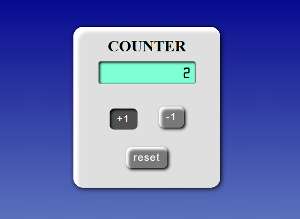

# 🧮 Simple Counter Web App

<div align="center">
  
</div>

A simple and elegant **Counter App** built using **HTML**, **CSS**, and **JavaScript**.  
This app allows users to increment, decrement, and reset a counter value — and it **remembers your last count** even after refreshing the page using `localStorage`.

---

## 🚀 Features

- ➕ Increase counter value  
- ➖ Decrease counter value  
- 🔄 Reset to zero  
- 💾 Saves counter value in browser `localStorage`  
- 🎨 Stylish and modern UI design with smooth shadows and gradients

---

## 🧰 Technologies Used

| Technology | Purpose |
|-------------|----------|
| **HTML5** | Page structure |
| **CSS3** | Styling and layout |
| **JavaScript (ES6)** | Counter logic and localStorage handling |

---

## 🧑‍💻 How to Run

1. **Clone this repository**
   ```
   git clone https://github.com/your-username/counter-app.git
   
2. **Open the project folder**
```
    cd counter-app
```

3. **Run the app**

- Simply open **index.html** in your web browser.

---

## 🧠 How It Works

- On page load, the app checks for a saved count value in localStorage.
- If a value exists, it displays it immediately.
- The +1 and –1 buttons modify the count and update localStorage.
- The Reset button sets the count back to zero and saves it again.

## 💡 Future Enhancements

- Add sound effects on button click
- Include custom step values (e.g., +5 / -5)
- Add dark & light mode toggle

## 🏷️ License

This project is open-source and available under the MIT License.

## 👨‍🎓 Developed by Velan

- Third-year BCA Student, Nrupathunga University 🏫
- 📅 October 2025
